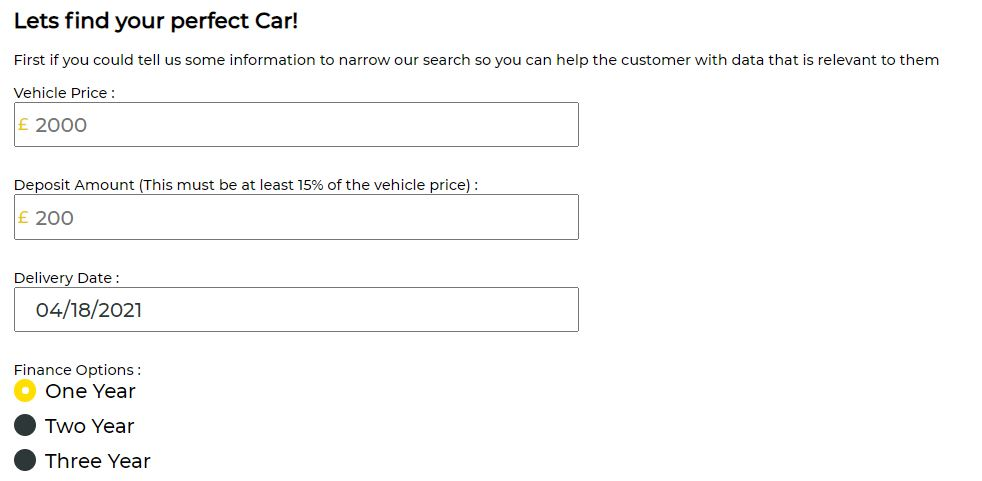
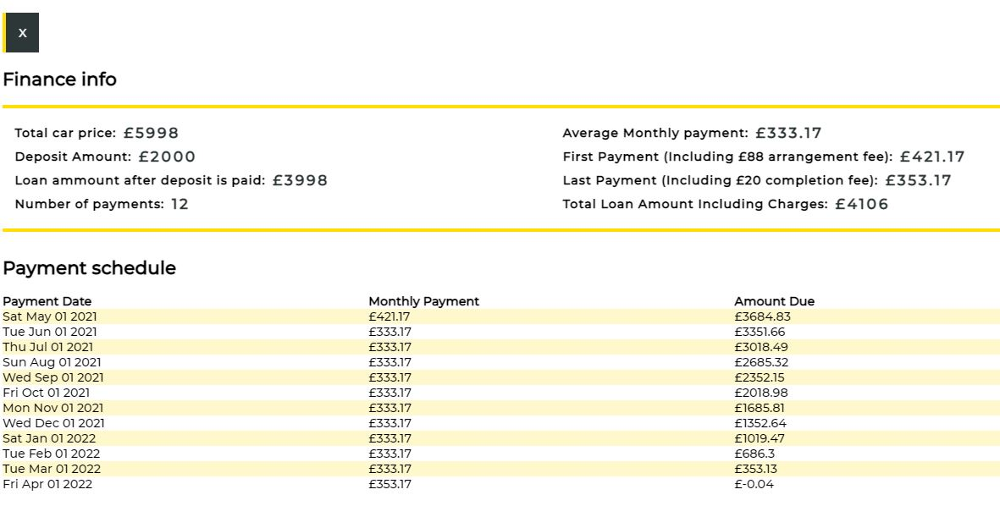
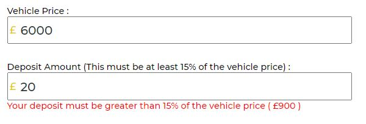
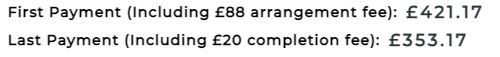
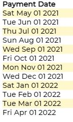

### Arnold Clark Code Test

This project was bootstrapped with [Create React App](https://github.com/facebook/create-react-app).

:heavy_check_mark: Prerequisites 

Before you continue, ensure you have met the following requirements:

* You have ran npm install
* You have a plug in called Moesif Origin and CORS Changer on chrome for CORS 

This Application was created as part of a code test for Arnold Clark. 

:girl: Created by : Laura Smith

:pushpin: Uses :- 
    "enzyme": "^3.11.0",
    "node-sass": "^5.0.0",
    "prop-types": "^15.7.2",
    "react": "^17.0.2",

:green_book: Project Criteria :- 

* The application should allow the Product Consultant to input a vehicle price, deposit amount, delivery date, and select from 1, 2, or 3-year finance options.
    * 
* The completed application should calculate and display a quote showing a summary of the loan and a payment schedule showing monthly payments with date and amount due.
    * 
* There is a minimum 15% deposit based on the vehicle price.
    * 
* On the first month’s payment add an £88 arrangement fee, and on the last a £20 completion fee.
    * 
* Payments are due on the first day of each month, beginning the month after delivery.
    * 
* Display the top six vehicles which may be affordable based on the monthly payments This will return a JSON response. Were most interested in the `searchResults` array.
    * 

> We’d like you to use React. On top of that, use whatever frontend libraries and tooling you feel comfortable with. We are interested in modern, clean coding principles, unit tests, advocating for the user in terms of UI/UX, demonstrating semantically correct and accessible HTML, and a maintainable approach to CSS.

### `npm start`

Runs the app in the development mode.\
Open [http://localhost:3000](http://localhost:3000) to view it in the browser.

The page will reload if you make edits.\
You will also see any lint errors in the console.
